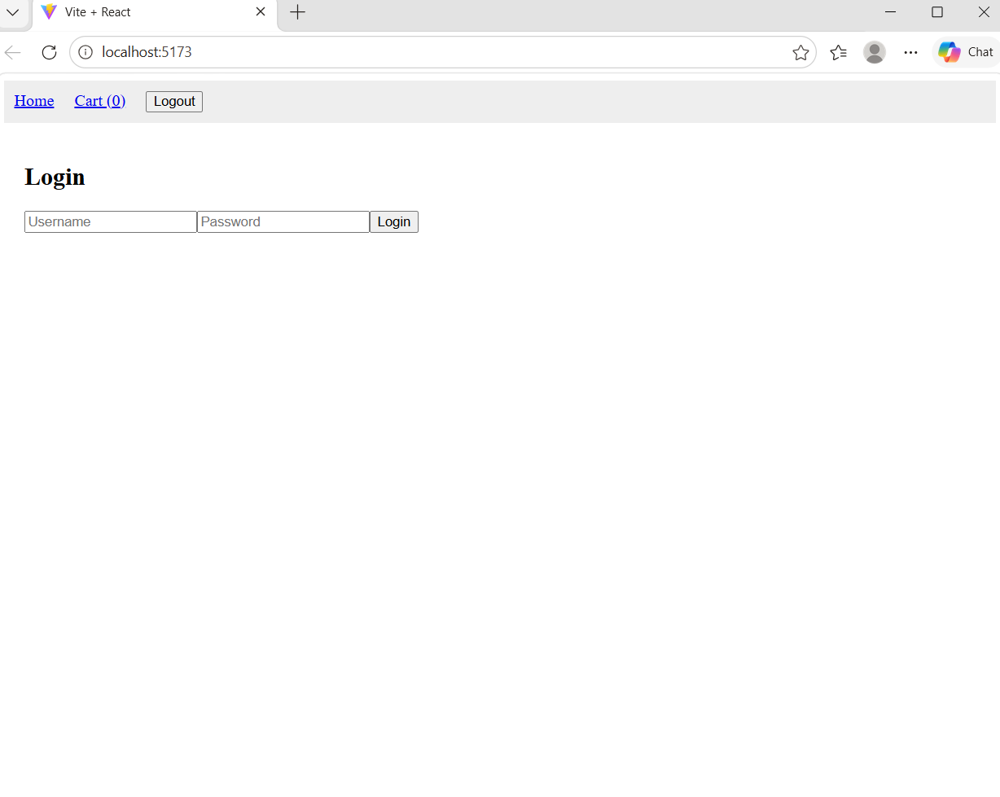

# 🛒 Shopping Site Web App

## 📌 Description
A responsive e-commerce web application built using React and Vite. This project demonstrates frontend development skills by creating a clean user interface for browsing products and managing basic shopping interactions.

## 🚀 Features
- Product listing and display
- Add to cart functionality
- Responsive UI design
- Fast performance using Vite

## 🛠️ Tech Stack
- React.js
- Vite
- JavaScript (ES6+)
- HTML5 & CSS3

## ▶️ How to Run
1. Clone the repository  
2. Run `npm install`  
3. Run `npm run dev`  
4. Open in browser  

## 📷 Screenshots

## 📚 What I Learned
- Building React components and managing state  
- Working with modern frontend tools like Vite  
- Structuring scalable frontend projects  

## 👩‍💻 Author
Saniya Khanum
